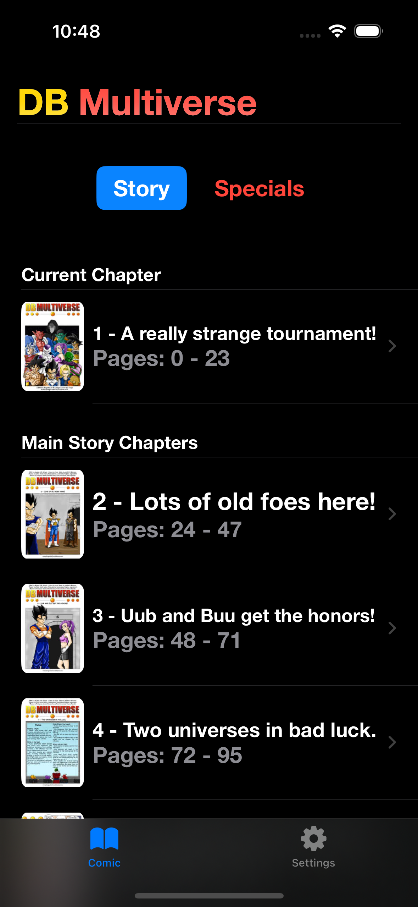
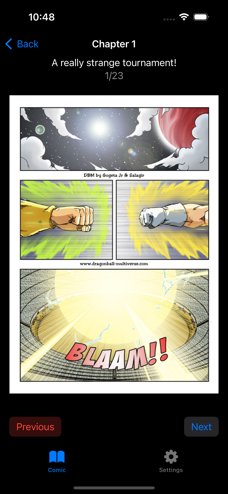
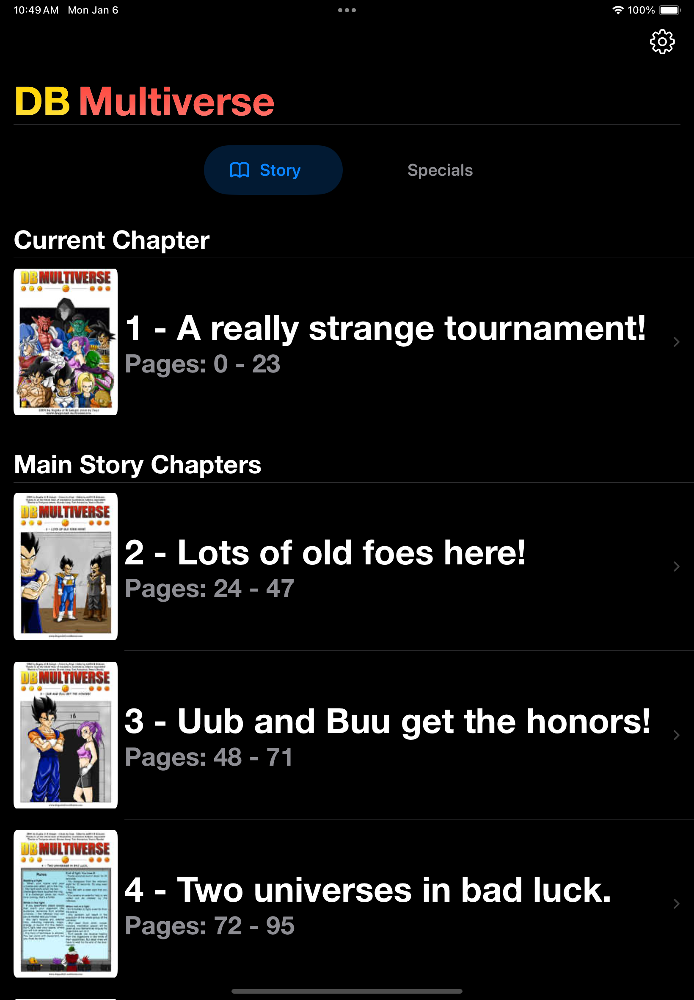
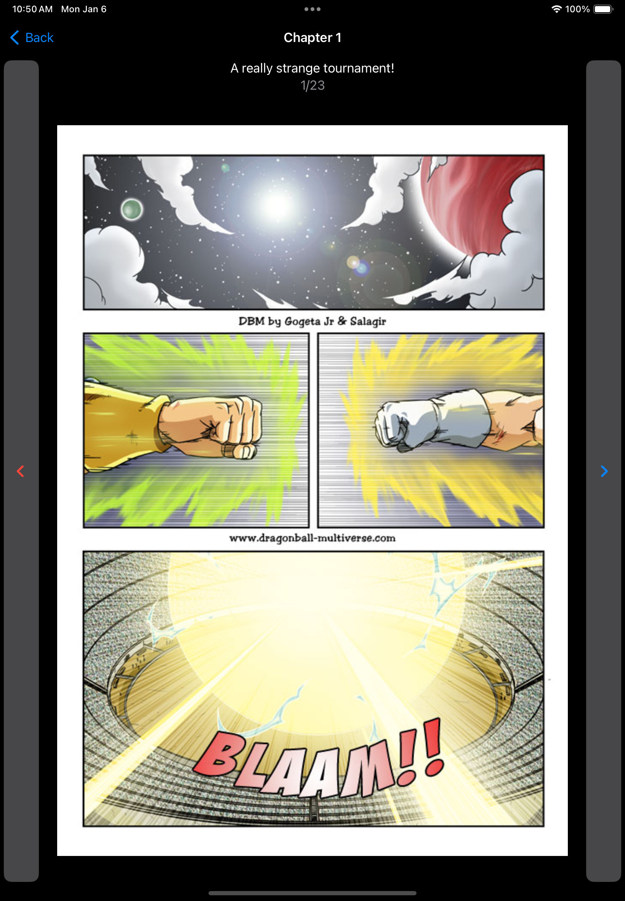

# Multiverse Reader

Multiverse Reader is an iOS application focused on delivering a high‑quality reading experience for the DB Multiverse webcomic. Beyond being a fan project, this repository serves as a reference implementation of a modular, testable SwiftUI architecture applied to a real‑world app.

## TestFlight
If you just want access to the app, it has been approved for beta testing through TestFlight (Apple's own beta testing app).

[Install Multiverse Reader with TestFlight](https://testflight.apple.com/join/8B21HpTS)

If you don't have TestFlight installed on your device, the link should first prompt you to install TestFlight, then you should be able to install Multiverse Reader.

## Table of Contents

- [Overview](#overview)
- [Screenshots](#screenshots)
  - [iPhone Screenshots](#iphone-screenshots)
  - [iPad Screenshots](#ipad-screenshots)
- [Installation](docs/XcodeInstallation.md)
- [Modules](#modules)
    - [DBMultiverse](docs/DBMultiverse_Documentation.md)
    - [ComicKit](docs/DBMultiverseComicKit_Documentation.md)
    - [ParseKit](docs/DBMultiverseParseKit_Documentation.md)
    - [Widgets](docs/DBMultiverseWidgets_Documentation.md)

- [License](LICENSE)

## Overview

Multiverse Reader is built with a strong emphasis on clear boundaries, explicit data flow, and long‑term maintainability.

The project intentionally separates concerns across multiple Swift packages, allowing each domain to evolve independently while remaining easy to test and reason about. While the app itself is designed for readers, the repository is equally intended to demonstrate production‑grade architectural decisions in a SwiftUI codebase.

## Technical Highlights

- Modular Swift Package architecture with strict separation of concerns
- SwiftUI‑driven navigation with minimal logic in views
- Explicit domain models decoupled from persistence and UI layers
- Background page loading and caching to ensure smooth reading performance
- Delegation‑based coordination for navigation, persistence, and side effects
- Extensive unit test coverage for core domain and view‑model logic
- Designed to support future extensions such as widgets and additional comic sources

## Screenshots

### iPhone Screenshots
(The name of the app changed. I'll get around to updating the screenshots soon.)

<table>
  <tr>
    <td align="center"><strong>Chapter List</strong></td>
    <td align="center"><strong>Comic View</strong></td>
  </tr>
  <tr>
    <td></td>
    <td></td>
  </tr>
</table>

### iPad Screenshots
(The name of the app changed. I'll get around to updating the screenshots soon.)

<table>
  <tr>
    <td align="center"><strong>Chapter List</strong></td>
    <td align="center"><strong>Comic View</strong></td>
  </tr>
  <tr>
    <td></td>
    <td></td>
  </tr>
</table>

## Installation

To install the app using Xcode:

1. **Open** Xcode (or **Download** it from the [Mac App Store](https://apps.apple.com/us/app/xcode/id497799835?mt=12)).
2. **Clone the project** from the [GitHub repository](https://github.com/nikolainobadi/DBMultiverse).
3. **Open the project** in Xcode by selecting the `DBMultiverse.xcodeproj` file.
4. **Connect your iPhone or iPad** and select it as the target device in Xcode.
5. **Run the app** by clicking the play button in Xcode.

For detailed installation steps, refer to the [Xcode Installation Guide](docs/XcodeInstallation.md).

## Modules

The **DBMultiverse** app is architected with modularity at its core, leveraging the separation of concerns to ensure scalability, maintainability, and ease of testing. Each module has a clearly defined purpose:

### 1. Core Application
- **Documentation**: [MultiverseReader](docs/DBMultiverse_Documentation.md)
- **Purpose**: Acts as the central layer that integrates functionality from all modules, orchestrating the primary app logic and navigation.

### 2. ComicKit Module
- **Documentation**: [ComicKit](docs/DBMultiverseComicKit_Documentation.md)
- **Purpose**: Manages comic-related functionality, including chapter handling, caching, and displaying comic pages with interactive features.

### 3. ParseKit Module
- **Documentation**: [ParseKit](docs/DBMultiverseParseKit_Documentation.md)
- **Purpose**: Responsible for parsing HTML data to extract comic metadata dynamically, enabling updates and ensuring accurate content delivery.

### 4. Widgets Module
- **Documentation**: [Widgets](docs/DBMultiverseWidgets_Documentation.md)
- **Purpose**: Extends the app’s functionality to the home screen, providing widgets that display chapter progress and enable quick navigation.

## Intended Audience

- Readers who want a clean, distraction‑free way to read DB Multiverse on iOS
- iOS developers interested in real‑world SwiftUI architecture and modularization
- Engineers looking for examples of testable domain logic in a UI‑driven application

## License

This project is licensed under the terms specified in the [LICENSE](LICENSE) file.
